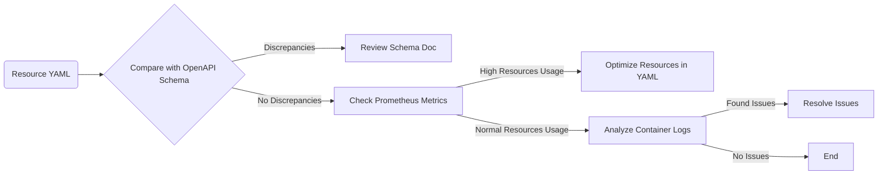

# Kubernetes Resource Analysis and Troubleshooting Guide

This guide explains how to analyze your Kubernetes resources, identify issues or potential areas of optimization, and resolve them to achieve a healthy cluster state.

## Prerequisites 
Before starting the steps below, gather your Kubernetes Resource YAML, OpenAPI Schema, Prometheus Metrics, and Container Logs.

## Step 1: OpenAPI Schema Comparison

Compare your Resource YAML with the OpenAPI schema. The OpenAPI schema represents the expected state of resources. 
```bash
kubectl explain --recursive <resource_type>
```
> This command will output the OpenAPI schema of the given Kubernetes resource_type. Compare it with the resource's current YAML definition.

Identify any discrepancies and refer to the relevant parts of the schema documentation for understanding the problem. For instance, if the schema expects a specific type of value for a property, but the resource YAML contains a different type, this could potentially lead to an issue.

## Step 2: Highlighting Issues and Potential Optimizations

In your Resource YAML:

```yaml
apiVersion: v1
kind: Pod
metadata:
  name: potential-issues-pod
  namespace: default
spec:
  containers:
  - name: my-container
    image: my-image
    resources:             # Potential area of optimization
      requests:
        memory: "64Mi"
        cpu: "250m"
      limits:
        memory: "128Mi"
        cpu: "500m"
```
> Annotations are added to highlight areas of potential corrections or optimizations.

## Step 3: Monitoring with Prometheus Metrics

Monitor the performance of your Pods using Prometheus. High CPU or memory usage could lead to resource contention and affect the performance of your application running within the cluster.

## Step 4: Analyzing Container Logs

Analyzing your container logs can provide deep insights into application behavior and can be helpful in troubleshooting complex issues which are not evident from resource configuration or metrics.

## Flowchart 

Below is a Mermaid chart outlining the steps:



## Conclusion

In this guide, we went through various steps such as OpenAPI schema comparison, highlighting potential issues and optimizations, monitoring with Prometheus metrics, and analyzing container logs. By following these steps, you can gain a better understanding of potential issues and how to resolve them.

Remember that this is a general guide. The actual troubleshooting process can differ based on the specific cluster composition, application architecture, and the policies of your organization. It's always best to consult with a Kubernetes expert or your DevOps team when in doubt.