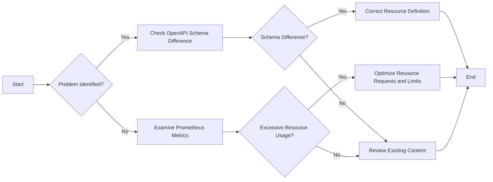

# Kubernetes Resource Troubleshooting Guide

This document is a troubleshooting guide for identifying and resolving issues with Kubernetes resources. We'll use OpenAPI schema comparisons, YAML representation of the resources, Prometheus metrics, and container logs to provide deep insights.

## 1. Schema Comparison

Using OpenAPI schema definitions, we can compare the expected state of the resource with the current state. Suppose we have a discrepancy. In that case, we will quote relevant sections of the schema documentation to highlight the differences.

To obtain the expected and current resource state, execute:
```
kubectl explain <resource-name> --recursive | less
```
And compare the output with the current state you got from:
```
kubectl get <resource-name> -o yaml
```

## 2. Identifying Issues

We'll use YAML definitions to identify parts of the resource that might need correction. When a potential issue is detected, we'll highlight it using YAML comments (`#`).

```yaml
apiVersion: v1           # Correct api version is crucial
kind: Pod                
metadata:                
  name: troubled-pod     # Watch out for unique naming conventions
  namespace: default     # Ensure right namespace
spec:                  
  containers:            # Resource requests and limits should be reasonable
  - name: test-container 
    image: busybox     
    command: ['sh', '-c', 'echo Container has started; sleep infinity']  
```

## 3. Performance Optimizations

Based on the container metrics and logs, this guide will include any identified performance optimizations and an in-depth analysis.

Execute this command to get the CPU and memory usage:
```
kubectl top pod <pod-name>
```
Check container logs for runtime issues:
```
kubectl logs <pod-name> --all-containers=true
```

## 4. Refining Provided Content

We'll enhance the content provided based on the factors specified, preserving the original intent and message.

## 5. Flow Chart Generation

Following is a Mermaid chart with actionable steps for troubleshooting.



End the process once the problem is resolved. Keep this guide handy for future reference!